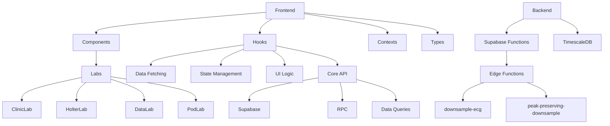

# ECG Lab Architecture Overview

## Application Structure



## Core Components

### Frontend

- **Component Layers**
  - `src/components/labs/`: Lab-specific views
  - `src/components/shared/`: Reusable UI elements
  - `src/context/`: Global state providers

- **Hook Organization**
  - `src/hooks/api/core/`: Core API utilities and Supabase configuration
  - `src/hooks/api/filters/`: Data querying and filtering hooks
  - `src/hooks/api/{domain}/`: Domain-specific hooks (clinic, pod, study, etc.)

- **Data Flow**
  1. User interaction triggers hook
  2. Hook calls Supabase RPC or uses core utilities
  3. Response stored in Zustand store
  4. Components consume store updates

### Backend Services

- **Supabase Infrastructure**
  - Edge Functions: ECG processing endpoints
  - RPC: Database functions for analytics
  - Realtime: Study status updates

- **Database**
  - TimescaleDB hypertables for ECG data
  - Regular Postgres tables for metadata

## Type System

### Core Type Organization
- `src/types/database.types.ts`: Database schema types
- `src/types/supabase.ts`: Supabase client types
- `src/types/filter.ts`: Filtering and query types
- `src/types/domain/`: Domain-specific types
- `src/types/utils.ts`: Utility types and type guards

All database entities typed in `src/types/database.types.ts`:

```typescript
interface ECGSample {
  time: string
  channel_1: number
  lead_on_p_1: boolean
  quality_1: boolean
  // ... other fields
}
```

## Data Query Layer

### Core Utilities
- `queryTable`: Generic table querying with type safety
- `callRPC`: Type-safe RPC function calls
- `handleSupabaseError`: Standardized error handling

### Filter System
- Advanced filtering with expressions
- Column-specific filters
- Client/server-side processing options
- Pagination and sorting support

## Key Dependencies

- **Frontend**
  - React/Next.js
  - TailwindCSS
  - Zustand
- **Backend**
  - Supabase
  - TimescaleDB
  - Deno (Edge Functions)
