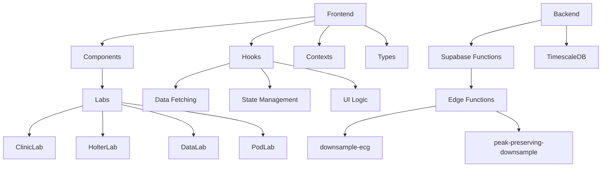

# ECG Lab Architecture Overview

## Application Structure



## Core Components

### Frontend

- **Component Layers**
  - `src/components/labs/`: Lab-specific views
  - `src/components/shared/`: Reusable UI elements
  - `src/context/`: Global state providers

- **Data Flow**
  1. User interaction triggers hook
  2. Hook calls Supabase RPC
  3. Response stored in Zustand store
  4. Components consume store updates

### Backend Services

- **Supabase Infrastructure**
  - Edge Functions: ECG processing endpoints
  - RPC: Database functions for analytics
  - Realtime: Study status updates

- **Database**
  - TimescaleDB hypertables for ECG data
  - Regular Postgres tables for metadata

## Type Definitions

All database entities typed in `src/types/database.types.ts`:

```typescript
interface ECGSample {
  time: string
  channel_1: number
  lead_on_p_1: boolean
  quality_1: boolean
  // ... other fields
}
```

## Key Dependencies

- **Frontend**
  - React/Next.js
  - TailwindCSS
  - Zustand
- **Backend**
  - Supabase
  - TimescaleDB
  - Deno (Edge Functions)
