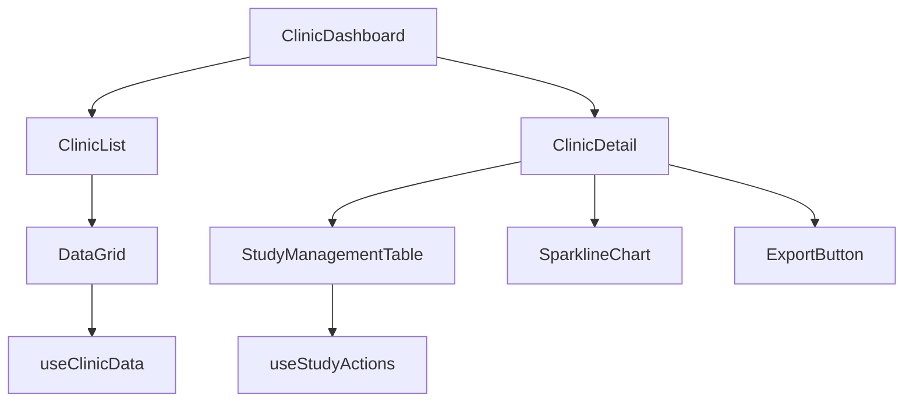

# ClinicLab Dashboard Redesign Plan

## 1. Component Architecture



**File Mapping:**
- `ClinicDashboard`: New component at `src/components/clinics/Dashboard.tsx`
- `ClinicList`: Extends `src/components/labs/HolterLab` layout patterns
- `useClinicData`: Modify existing `src/hooks/api/core/useDatasets.ts`
- `useStudyActions`: Extend `src/hooks/api/study/useSingleStudy.ts`

## 2. Core Components

### 2.1 Clinic List View

**Implementation Steps:**
1. **VIP Toggle Column**
   ```tsx
   // In src/components/clinics/DataGrid.tsx
   const vipRenderer = (params) => (
     <Switch 
       checked={params.value}
       onChange={(e) => updateVipStatus(params.row.id, e.target.checked)}
     />
   );
   ```
   - Integrate with `useClinicData` mutation
   - Add PATCH endpoint in Supabase RPC

2. **Row Coloring**
   ```scss
   // src/styles/clinics.module.scss
   :root {
     --vip-row: #fff3e0;
     --active-row: #e8f5e9;
   }
   ```
   - Apply via `sx` prop in DataGrid

3. **Virtual Scroll**
   ```ts
   // Modify src/hooks/api/core/useDatasets.ts
   const { data, fetchMore } = useInfiniteQuery(...);
   ```

### 2.2 Clinic Detail View

**Component Implementation:**
1. **StudyManagementTable**
   ```tsx
   // src/components/clinics/StudyManagement.tsx
   export default function StudyManagementTable() {
     const { studies } = useStudyActions();
     return <DataGrid rows={studies} />;
   }
   ```

2. **SparklineChart**
   ```tsx
   // src/components/charts/Sparkline.tsx
   import { SparkLine } from '@visx/sparkline';
   ```

## 3. Technical Specifications

### 3.1 Supabase Integration

**Real-time Updates:**
```ts
// src/hooks/api/core/useClinicData.ts
const channel = supabase
  .channel('clinics')
  .on('postgres_changes', { event: '*', schema: 'public' }, () => refetch());
```

**IndexedDB Caching:**
```ts
// New file src/lib/idb.ts
const db = new Dexie('ClinicCache');
db.version(1).stores({ clinics: 'id,lastUpdated' });
```

## 4. Backend Changes

**SQL Migrations:**
```sql
-- New migration in supabase/migrations/20250225000000_dashboard.sql
ALTER TABLE clinics ADD COLUMN vip_status BOOLEAN DEFAULT FALSE;
CREATE TABLE audit_logs (...);
```

**Edge Function:**
```ts
// supabase/functions/clinic-report/index.ts
Deno.serve(async (req) => {
  const { clinicId } = await req.json();
  // Generate report logic
});
```

## 5. Implementation Phases

### Phase 1: Core Components (2 days)

1. **DataGrid Modifications**
   - [ ] Create `src/components/clinics` directory
   - [ ] Add VIP column component
   - [ ] Implement row coloring system

2. **Filtering/Sorting**
   - [ ] Extend `useDatasets` hook with filter state
   - [ ] Add debounce to search input

### Phase 2: Detail View (3 days)

1. **Study Management**
   - [ ] Create CRUD actions in `useStudyActions`
   - [ ] Implement bulk selection in DataGrid

2. **Export Functionality**
   - [ ] Add CSV generator in `src/lib/export.ts`
   - [ ] Web Worker for large datasets

## 6. Risk Mitigation

1. **Real-time Latency**
   - Implement optimistic UI updates
   - Add sync status indicator

2. **Rendering Performance**
   - Test with 10k rows using `@tanstack/react-virtual`
   - Add loading skeletons

3. **Browser Support**
   - Polyfill for IndexedDB
   - Fallback polling mechanism
